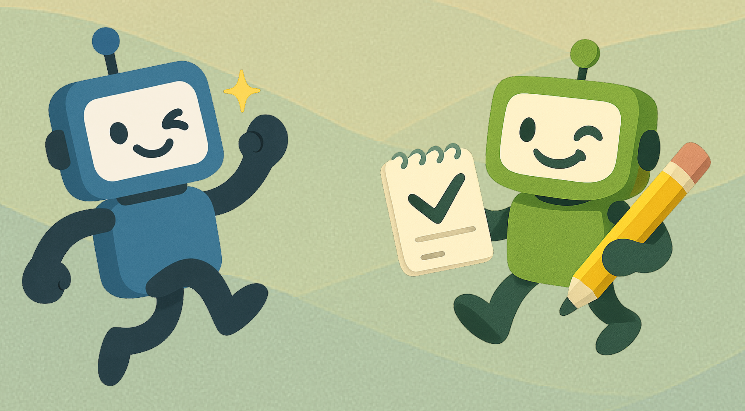
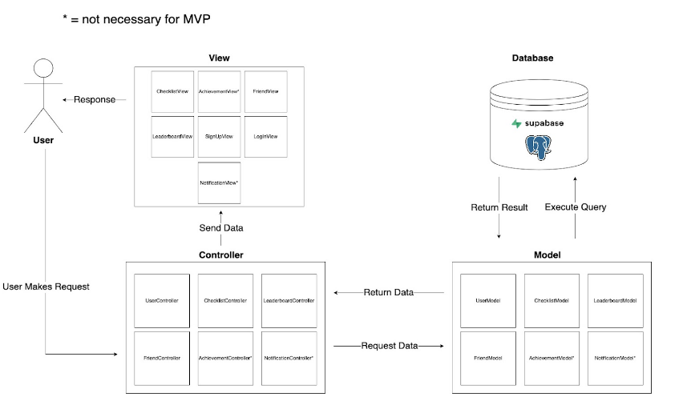
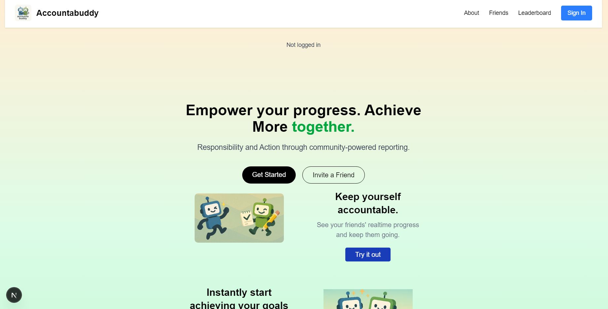

# Accountabuddy

* Authors: 
[Nolan Kosmal](https://github.com/Mightymango1), [Kevin Wu](https://github.com/KevinWu085), [Joshua Sevilla](https://github.com/Joshuahsevilla), [Jason Lee](https://github.com/jalee314), [Aryn Granados](https://github.com/ArynGrand), [Ilhaan S Abdullah]()
 

* **Specifications**  
  - **Platform:** Website  
  - **Front-end:** React.js, Tailwind CSS, deployed on Vercel  
  - **Back-end:** JavaScript  
  - **Database:** Supabase  
  - **UI Design:** Figma  

 

* **Motivation of the project**
  - Dilemma of negative pressure to work, which can cause burnout and a bigger motivation not to do work  
  - Instead of making schoolwork feel isolating or daunting, we want to use positive social reinforcement to make getting work done easier  
  - Keeping track of the amount of work you have gotten done is sometimes ambiguous, so an achievement system would provide a sign of concrete progress  
  - By getting friends involved, an element of competition is added to possibly mundane tasks, making users more inclined to get their work done  
  - Using friendly competition through a leaderboard would gamify the product, making it more interesting for the user  
 

* **Functionalities**  
  - Creating/signing in for users  
  - Users can add and remove checklist items  
  - List deadlines  
  - Prioritize list items  
  - Check off completed items  
  - SMS function for friends to send reminders  
  - Search for different users  
  - Add friends on the website  
  - Achievements (streaks / reward system for consistency)  
  - Leaderboard  

*  **Software Architecture Pattern**  

*  **entity diagram**

  
*  **webtsite looks**

